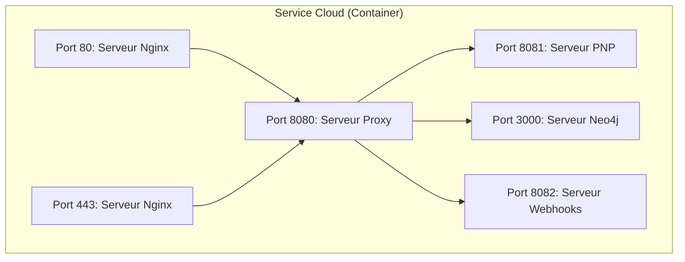

# VnV-Servers

- [Ngnix](./ngnix.md) :
- [Proxy-server](./vnv-proxy-server.md) : 
- [Neo-server](./vnv-neo-rest.md) : 
- [Pnp-server](./vnv-pnp-rest.md) : 
- [Event-bridge-server](./vnv-event-bridge.md) : 

## Envs

- `Dev` : [Local Environment - **localhost:8080**]( http://localhost:8080 )
- `Test` : [Test Environment - **18.156.162.178:8080**]( http://18.156.162.178:8080 )
- `Prod` : [Prod Environment]( https://not-ready-yet-with-secure-connexion )