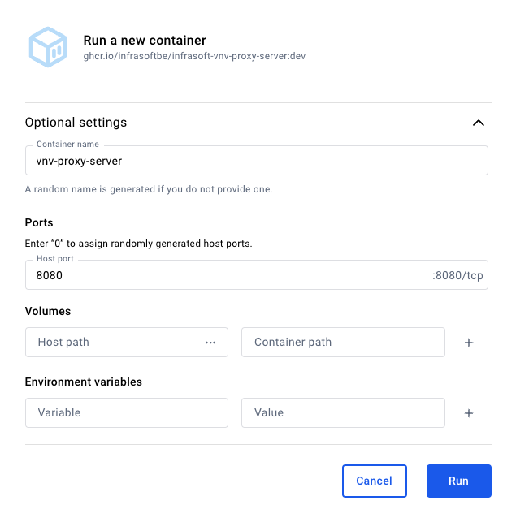

# @ghrc/vnv-proxy-server

### 1. **Télécharger l’Image Docker depuis GHCR**

L’image Docker est disponible avec le nom `ghcr.io/infrasoftbe/infrasoft-vnv-proxy-server:latest` à cette [adresse](https://github.com/orgs/infrasoftbe/packages/container/package/infrasoft-vnv-proxy-server).

Pour la télécharger localement :

1. **Connectez-vous à GHCR** dans votre terminal :
    
    ```bash
    echo "${GHCR_TOKEN}" | docker login ghcr.io -u "infrasoftbe" --password-stdin
    ```
    
    - Remplacez `${GHCR_TOKEN}` et par vos informations :
        - `GHCR_TOKEN` : Votre token .
2. **Pull l’image Docker** :
    
    ```bash
    docker pull ghcr.io/infrasoftbe/infrasoft-vnv-proxy-server:dev
    ```
    
3. **Vérifiez si l’image est téléchargée** :
    
  ```bash
  docker images
  ```
    
  Vous devriez voir l’image avec le nom `ghcr.io/infrasoftbe/infrasoft-vnv-proxy-server` et le tag `latest`.

  :::tip

    ### Gerez votre auth

    Pour éviter de saisir manuellement vos informations d’authentification à chaque interaction avec GHCR, vous pouvez configurer une authentification persistante en éditant le fichier **~/.docker/config.json**. Voici les étapes détaillées :
    
    1. **Obtenir le token encodé en base64 :**
    
    Combinez votre nom d’utilisateur et votre token personnel sous la forme `username:password` (où le token remplace le mot de passe), puis encodez cette chaîne en base64 :
    
    ```tsx
    echo -n "username:password" | base64
    ```
    
    **Exemple de sortie :**
    
    Si votre nom d’utilisateur est `infrasoftbe` et votre token est `ghcr_token123`, la commande renverra une chaîne comme :
    
    ```bash
    aW5mcmFzb2Z0YmU6Z2hjcl90b2tlbjEyMw==
    ```
    
    2. **Modifier le fichier `~/.docker/config.json` :**
    
    Ajoutez l’entrée pour GHCR dans votre fichier de configuration Docker. Si le fichier existe déjà, éditez-le pour qu’il ressemble à ceci :
    
    ```json
    {
      "auths": {
        "ghcr.io": {
          "auth" : "aW5mcmFzb2Z0YmU6Z2hjcl90b2tlbjEyMw=="
        }
      },
      "credsStore": "desktop"
    }
    ```
    
    Si le fichier n’existe pas, créez-le dans votre répertoire utilisateur (`~/.docker/`).
    
    3. **Valider la configuration :**
    
    Une fois la modification effectuée, testez l’authentification avec une commande comme celle-ci :
    
    ```bash
    docker pull ghcr.io/infrasoftbe/infrasoft-vnv-proxy-server:latest
    ```
    
    Si tout est configuré correctement, Docker téléchargera l’image sans vous demander de vous reconnecter.
    
    4. **Alternative avec Credential Store (Optionnel) :**
    
    Docker peut également gérer vos identifiants de manière sécurisée avec un gestionnaire de credentials, comme indiqué avec la clé `"credsStore": "desktop"`. Si cette méthode est activée, Docker utilisera automatiquement vos identifiants stockés.
    
    Vérifiez le statut de votre `credsStore` avec :
    
    ```bash
    docker info | grep "credsStore"
    ```
    
    Si vous souhaitez en savoir plus sur la configuration des credentials Docker, reportez-vous à la [documentation officielle](https://docs.docker.com/reference/cli/docker/login/#credentials-store).

  :::
    

---

### 2. **Exécuter l’Image Docker**

Une fois l’image téléchargée, vous pouvez la lancer comme un conteneur Docker.

### Commande simple pour exécuter le conteneur :

```bash
docker run -d -p 8080:8080 --name vnv-proxy-server ghcr.io/infrasoftbe/infrasoft-vnv-proxy-server:dev
```

- **`d`** : Lance le conteneur en arrière-plan.
- **`p 8080:8080`** : Mappe le port 80 du conteneur au port 8080 de votre machine locale.
- **`-name`** : Donne un nom au conteneur (`vnv-proxy-server` ici).

---

### 3. **Gérer les Mises à Jour**

Si vous publiez une nouvelle version :

1. Re-téléchargez l’image :
    
    ```bash
    docker pull ghcr.io/infrasoft/infrasoft-vnv-proxy-server:dev
    ```
    
2. Arrêtez l’ancien conteneur :
    
    ```bash
    docker stop vnv-proxy-server
    docker rm vnv-proxy-server
    ```
    
3. Relancez le nouveau conteneur avec la commande `docker run`.

---

### 4. **Configurer Docker Desktop**

Si vous utilisez l'interface Docker Desktop, vous pouvez :

1. Aller dans l’onglet **Images**.
2. Rechercher `ghcr.io/infrasoftbe/infrasoft-vnv-proxy-server`.
3. Cliquer sur **Run** pour démarrer le conteneur.
4. **Configurez** le conteneur.
    
    
    

---

### 5. **Vérifier le Bon Fonctionnement**

- Pour voir les logs du conteneur :
    
    ```bash
    docker logs vnv-proxy-server
    ```
    
- Pour accéder à votre application, ouvrez un navigateur et rendez-vous sur `http://localhost:8080` (en supposant que l'application expose une interface Web).